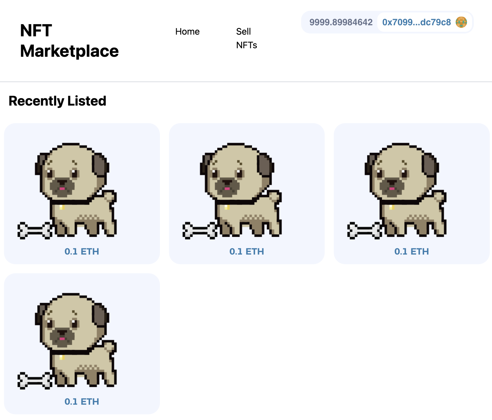

# NFT Marketplace with Hardhat, Thegraph, and Next.js

Welcome to the NFT Marketplace project repository! This decentralized application (DApp) combines the power of Hardhat for smart contract development, Subgraph for efficient data indexing, and Next.js for a user-friendly frontend. The project aims to provide a seamless and transparent platform for NFT (Non-Fungible Token) creation, trading, and exploration.

<br/>
<p align="center">

</a>
</p>

## Table of Contents

- [📍 Overview](#overview)
- [⚙️ Features](#features)
- [🧩 Requirements](#🧩-requirements)
- [📂 Project Structure](#project-structure)

## 📍 Overview

The NFT Marketplace project introduces a decentralized platform where creators and collectors can engage in NFT transactions securely and transparently. This repository contains the code for three integral components:

1. **Hardhat Contracts:** Solidity smart contracts that handle NFT creation, ownership, trading, and associated functionalities.

2. **Subgraph:** A Subgraph deployment that efficiently indexes and queries data from the blockchain, providing real-time insights into NFT ownership and marketplace trends.

3. **Next.js Frontend:** An immersive user interface built using Next.js, allowing users to explore NFTs, trade, and manage their collections.

## ⚙️ Features

- NFT Creation and Ownership
- Secure Peer-to-Peer Transactions
- Real-time NFT Insights
- User Profiles and Collections
- NFT Trending
- Interactive NFT Listings


## 🧩 Requirements

- [git](https://git-scm.com/book/en/v2/Getting-Started-Installing-Git)
  - You'll know you did it right if you can run `git --version` and you see a response like `git version x.x.x`
- [Nodejs](https://nodejs.org/en/)
  - You'll know you've installed nodejs right if you can run:
    - `node --version` and get an ouput like: `vx.x.x`
- [Yarn](https://classic.yarnpkg.com/lang/en/docs/install/) instead of `npm`
  - You'll know you've installed yarn right if you can run:
    - `yarn --version` and get an output like: `x.x.x`
    - You might need to install it with `npm`


## 📂 Project Structure


```bash
repo
├── README.md
├── frontend
│   ├── README.md
│   ├── components
│   │   ├── Header.tsx
│   │   ├── Layout.tsx
│   │   ├── NFTBox.tsx
│   │   ├── NetworkBanner.tsx
│   │   ├── SellNFTModal.tsx
│   │   └── UpdateListingModal.tsx
│   ├── constants
│   │   ├── BasicNft.json
│   │   ├── NftMarketplace.json
│   │   ├── networkMapping.json
│   │   └── subgraphQueries.ts
│   ├── img
│   │   ├── connected.png
│   │   ├── down-arrow.png
│   │   ├── functions.png
│   │   └── hero.png
│   ├── next-env.d.ts
│   ├── next.config.js
│   ├── package.json
│   ├── pages
│   │   ├── _app.tsx
│   │   ├── api
│   │   │   └── hello.ts
│   │   ├── buy-nft.tsx
│   │   ├── graphExample.tsx
│   │   ├── index.tsx
│   │   └── sell-nft.tsx
│   ├── postcss.config.js
│   ├── public
│   │   ├── favicon.ico
│   │   └── vercel.svg
│   ├── styles
│   │   ├── Home.module.css
│   │   └── globals.css
│   ├── tailwind.config.js
│   ├── tsconfig.json
│   └── yarn.lock
├── hardhat
│   ├── README.md
│   ├── contracts
│   │   ├── NftMarketplace.sol
│   │   └── test
│   │       ├── BasicNft.sol
│   │       └── BasicNftTwo.sol
│   ├── deploy
│   │   ├── 01-deploy-nft-marketplace.ts
│   │   ├── 02-deploy-basic-nft.ts
│   │   └── 03-update-front-end.ts
│   ├── gas-report.txt
│   ├── hardhat.config.ts
│   ├── helper-hardhat-config.ts
│   ├── img
│   │   ├── connected.png
│   │   ├── down-arrow.png
│   │   ├── functions.png
│   │   └── hero.png
│   ├── package.json
│   ├── scripts
│   │   ├── buy-item.js
│   │   ├── cancel-item.js
│   │   ├── mine.js
│   │   ├── mint-and-list-item.js
│   │   └── mint.js
│   ├── test
│   │   └── unit
│   │       └── NftMarketplace.test.ts
│   ├── tsconfig.json
│   ├── utils
│   │   ├── move-blocks.ts
│   │   └── verify.ts
│   └── yarn.lock
└── subgraph
    ├── README.md
    ├── abis
    │   └── NftMarketplace.json
    ├── generated
    │   ├── NftMarketplace
    │   │   └── NftMarketplace.ts
    │   └── schema.ts
    ├── package.json
    ├── schema.graphql
    ├── src
    │   └── mapping.ts
    ├── subgraph.yaml
    ├── subgraphQueries.ts
    ├── tsconfig.json
    └── yarn.lock

23 directories, 69 files
```
